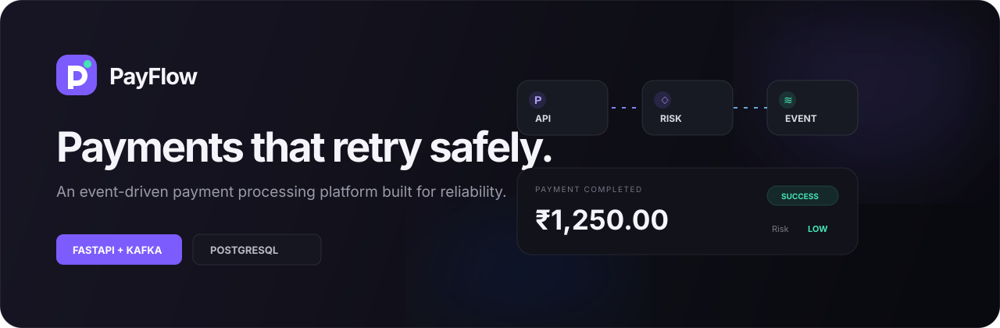
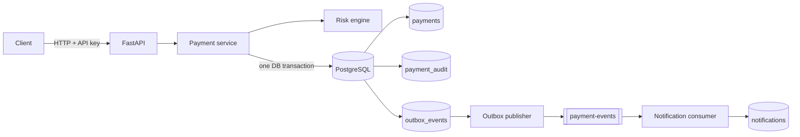

<p align="center">
  
</p>

<p align="center">
  <strong>FastAPI</strong> · <strong>PostgreSQL</strong> · <strong>Kafka</strong> · <strong>SQLAlchemy</strong> · <strong>Docker</strong>
</p>

<p align="center">
  <a href="#quick-start">Quick start</a> ·
  <a href="#architecture">Architecture</a> ·
  <a href="#api-contract">API</a> ·
  <a href="#test-and-quality-checks">Testing</a> ·
  <a href="CONTRIBUTING.md">Contributing</a>
</p>

---

PayFlow is a production-inspired payment processing backend built with FastAPI, PostgreSQL,
and Kafka. It demonstrates reliable transaction processing through idempotent APIs, deterministic
risk assessment, durable state, and asynchronous event consumption.

> PayFlow is an educational system. It does not integrate with banks or move real money.

## What it demonstrates

- Duplicate-safe payment creation at both the application and database layers
- A rule-based risk engine that rejects high-value and high-velocity payments
- Transactional outbox publishing so a committed payment cannot silently lose its Kafka event
- An independently deployable Kafka consumer that persists simulated notifications
- API-key authentication, consistent error contracts, structured logs, and health reporting
- Alembic migrations, Docker Compose, automated tests, linting, and GitHub Actions

## Architecture



The API commits a payment, its audit history, and its pending event atomically. The background
relay publishes pending outbox rows to Kafka and marks them published. A Kafka outage therefore
degrades asynchronous delivery without undoing or losing the core payment record.

## Payment lifecycle

```text
PENDING -> SUCCESS
        \-> REJECTED (risk score >= 50)
```

The transition is calculated before the atomic commit. `FAILED` is reserved for future technical
payment-rail failures; this project intentionally has no real bank integration.

## Requirements coverage

| ID | Requirement | Implementation |
|---|---|---|
| FR-01 | Create a payment | `POST /payments` |
| FR-02 | Validate request | Pydantic schema plus service invariants |
| FR-03 | Unique transaction ID | Random `pay_<16 hex>` identifier plus unique constraint |
| FR-04 | Persist transaction | PostgreSQL through SQLAlchemy 2 |
| FR-05 | Track status | Explicit status enum and terminal transition |
| FR-06 | Prevent duplicate processing | Request fingerprint, lookup, and unique idempotency constraint |
| FR-07 | Assess risk | Amount and 60-second sender-velocity rules |
| FR-08 | Publish event | Transactional outbox relay to `payment-events` |
| FR-09 | Consume event | Independent notification consumer with duplicate protection |
| FR-10 | Retrieve payment | `GET /payments/{transaction_id}` and paginated list |
| FR-11 | Return safe errors | Stable `{error, message}` response contract |
| FR-12 | Authenticate API | Constant-time `X-API-Key` validation |
| FR-13 | Retain audit data | Timestamped lifecycle records in `payment_audit` |
| FR-14 | Report health | `GET /health` |

## Risk rules

| Condition | Score |
|---|---:|
| Amount greater than INR 50,000 | +50 |
| Five prior payments from the sender within 60 seconds | +50 |

A score of 50 or more is `HIGH` risk and produces a `REJECTED` payment. Lower scores produce a
`SUCCESS` payment. The sixth rapid payment is rejected because five earlier payments already
exist in the lookback window.

## Quick start

Requirements: Docker with Compose v2.

```bash
cp .env.example .env
# Set a strong API_KEY in .env, then:
docker compose up --build
```

Open `http://localhost:8000` for the project overview. The interactive API documentation is at
`http://localhost:8000/docs`, PostgreSQL at port `5432`, and Kafka at port `29092` for
host-native clients. Containers use the internal `kafka:9092` listener.

The initial migration creates three demonstration accounts: `101`, `205`, and `301`.

Create a payment:

```bash
curl --request POST http://localhost:8000/payments \
  --header 'Content-Type: application/json' \
  --header 'X-API-Key: your-api-key' \
  --header 'Idempotency-Key: 71eab261-928d-4ea7' \
  --data '{
    "sender_id": 101,
    "receiver_id": 205,
    "amount": 1250.00,
    "currency": "INR"
  }'
```

Send the same payload and key again to receive the original payment with `200 OK`. Reusing the key
for a different payload returns `409 Conflict`.

Fetch or list payments:

```bash
curl --header 'X-API-Key: your-api-key' http://localhost:8000/payments/pay_example
curl --header 'X-API-Key: your-api-key' 'http://localhost:8000/payments?limit=20&offset=0'
```

Stop the stack while retaining data with `docker compose down`. Add `--volumes` only when you
deliberately want to delete local PostgreSQL and Kafka data.

## Native development

Python 3.12, PostgreSQL, and Kafka are required.

```bash
python -m venv .venv
source .venv/bin/activate
make install
cp .env.example .env
alembic upgrade head
make run
```

In a second terminal, start the consumer:

```bash
source .venv/bin/activate
make consumer
```

## API contract

| Method | Path | Auth | Purpose |
|---|---|---|---|
| `POST` | `/payments` | API key + idempotency key | Create or replay a payment |
| `GET` | `/payments/{transaction_id}` | API key | Retrieve one payment |
| `GET` | `/payments?limit=20&offset=0` | API key | List payments |
| `GET` | `/health` | Public | Check API, database, and Kafka status |
| `GET` | `/docs` | Public | OpenAPI documentation |

Example success event:

```json
{
  "event_type": "PAYMENT_COMPLETED",
  "transaction_id": "pay_f12345",
  "sender_id": 101,
  "receiver_id": 205,
  "amount": "1250.00",
  "currency": "INR",
  "status": "SUCCESS",
  "risk_level": "LOW",
  "reason": null,
  "timestamp": "2026-09-15T12:00:00+00:00"
}
```

Errors have a stable shape:

```json
{
  "error": "IDEMPOTENCY_KEY_REUSED",
  "message": "This idempotency key was already used for a different payment request"
}
```

## Test and quality checks

```bash
make lint
make test
```

The suite covers authentication, validation, account checks, retrieval, pagination, both risk
rules, successful creation, idempotent replay, and idempotency-key conflicts. CI runs the same
checks on pushes to `main` and on pull requests.

## Project layout

```text
app/
├── api/                 HTTP routes
├── kafka/               outbox publisher and notification consumer
├── repositories/        persistence queries
├── services/            payment orchestration and risk rules
├── config.py            environment-backed settings
├── database.py          async SQLAlchemy setup
├── errors.py            domain error contract
├── logging.py           structured JSON logging
├── main.py              application lifecycle and health API
├── models.py            database models
├── schemas.py           request and response models
└── security.py          API-key authentication
migrations/              versioned database schema
tests/                   API and business-logic tests
compose.yaml             API, consumer, PostgreSQL, and Kafka
```

## Important design decisions

**Idempotency semantics.** A repeated key returns the original transaction only when its canonical
request fingerprint matches. A different payload with the same key is a client conflict, not a
replay. The database constraint closes the race between simultaneous requests.

**At-least-once event delivery.** The outbox relay can publish an event before crashing prior to
marking it delivered. Consumers must therefore be idempotent. The included consumer enforces one
notification per transaction with a unique constraint.

**Money representation.** Amounts use `Decimal` in Python and `NUMERIC(18, 2)` in PostgreSQL. They
are serialized as strings in events so downstream consumers do not lose precision.

**Accounts.** Account records exist only to demonstrate sender/receiver existence validation. User
registration, balances, and real money movement are deliberately outside this project's scope.

## Future production work

- Introduce real payment-rail authorization and a controlled `FAILED` transition
- Replace shared API keys with short-lived service identity or OAuth/JWT authorization
- Add dead-letter handling, outbox retry metadata, tracing, metrics, and alerting
- Apply database row-level concurrency controls for balance updates
- Add contract tests against a real Kafka broker and PostgreSQL in CI
- Complete threat modeling, secrets management, encryption, and applicable financial compliance

See [CONTRIBUTING.md](CONTRIBUTING.md) for contribution expectations and
[SECURITY.md](SECURITY.md) for the vulnerability-reporting policy.
